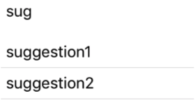

# react-native-autocomplete-select

> Simple AutoComplete with selection for react-native

[](http://standardjs.com/) [](https://travis-ci.org/Vizir/react-native-autocomplete-select)
[](https://codeclimate.com/github/Vizir/react-native-autocomplete-select)
[](https://codeclimate.com/github/Vizir/react-native-autocomplete-select/coverage)
[](https://codeclimate.com/github/Vizir/react-native-autocomplete-select)


## Install

```bash

npm install --save react-native-autocomplete-select

```

## Usage

Simple example:

```JavaScript

import AutoComplete from 'react-native-autocomplete-select'

...

const onSelect = (suggestion) => {
  console.log(suggestion) // the pressed suggestion
}

const suggestions = [
  {text: 'suggestion1', anotherProperty: 'value'},
  {text: 'suggestion2', anotherProperty: 'value2'}
]

<AutoComplete
  onSelect={onSelect}
  suggestions={suggestions}
  suggestionObjectTextProperty='text'
  value='sug'
/>

```

Will output:



| Available Properties | Description |
-----------------------|-----------------
| suggestions | An array of objects or values to use as suggestions |
| value | Current value of the input |
| minimumSimilarityScore | Value from 0 (matches anything) to 1 (only matches if the strings are the same), defaults to 0.6. The input value will be compared to the suggestion, the suggestion score should be greater than or equal to this value to be shown.  |
| comparationFuzziness | Value from 0 to 1, defaults to 0.5. This is the fuzziness level used on similarity comparation. |
| suggestionObjectTextProperty | If the suggestions in the array are objects, this will be used to get the suggestion value. The value will be shown on the list and will be used to check the similarity of the suggestion to the input value. |
| onChangeText | Function to execute when the input value changes. |
| onSelect | (Required) Function to call when a suggestion is pressed. Will be called with the suggestion as a parameter |
| suggestionsWrapperStyle | Style of the list of suggestion. |
| suggestionStyle | Style of the suggestion item in the list. |
| suggestionTextStyle | Style of the suggestion text. |
| style | Style of the component. |
| inputStyle | Style of the text input. |

## Contributing

1. Fork this repository
2. Create a branch based on master about what you are doing
  - Names should be separated by hyphen: example-name
3. Commit using the format: \[\<type\>\] \<message\>
  - The type should be: Feat, Fix, Refactor or Docs
  - Example message: \[Docs\] Added contributing to readme
  - Do not forget to add tests!
4. Run all tests `npm test` and linter `npm run lint`
5. Create a pull request describing the changes you made

## License

[MIT](https://opensource.org/licenses/MIT)
